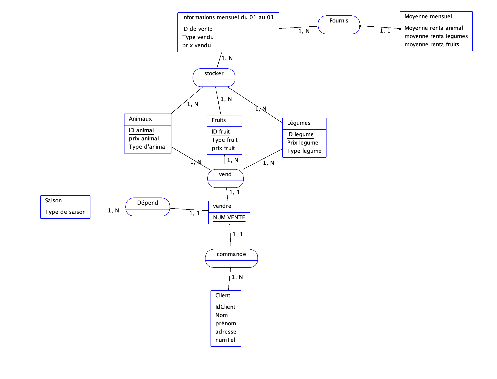
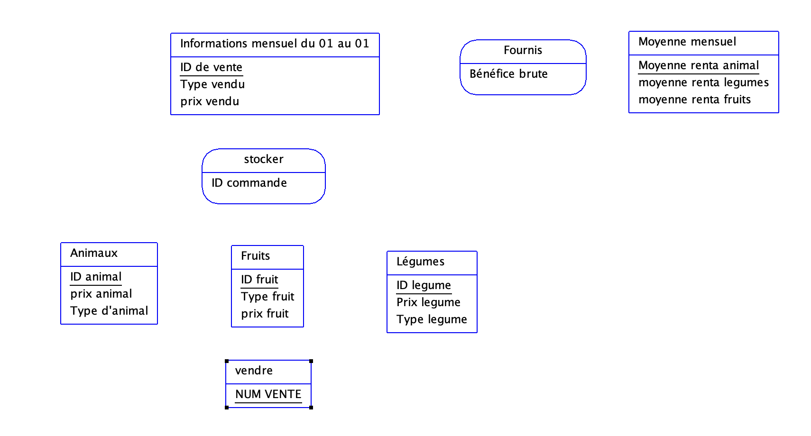

# le recueil d'informations
## interview/enquete
## etude des documets internes
# #etude des documents externes
# les types d'informations
## les informations ## les info elementaires

### La modélisation de données est le processus de création d'un modèle pour organiser et structurer les données d'une manière qui reflète les relations et les contraintes entre les différentes entités d'un système. Cela permet de comprendre et de documenter les besoins en données d'une organisation, facilitant ainsi la conception et la mise en œuvre de bases de données.
 
### Merise est une méthode de conception de systèmes d'information qui se concentre sur la modélisation des données et des traitements. Elle est largement utilisée en France et se compose de plusieurs étapes et modèles, notamment :
 
### Modèle Conceptuel des Données (MCD) : Représente les entités et les relations entre elles sans se soucier des aspects techniques.
### Modèle Logique des Données (MLD) : Traduit le MCD en un modèle plus proche de la structure de la base de données, en tenant compte des contraintes d'intégrité.
### Modèle Physique des Données (MPD) : Détaille la manière dont les données seront physiquement stockées dans la base de données.
### Merise inclut également des modèles pour les traitements et les flux d'information, permettant une approche complète de la conception des systèmes d'information.
 
 
# Le recueil d'informations
## Interview/Enquete
## Etude des documents internes
## Etude des documents externes
# Les types d'informations
### Les info elementaires
 
Une info elementaire doit etre atomique:
 
- 34 rue de la paix => adresse <!-- 34 rue de la paix est une occurence -->
- 75000 => code postal
- Paris => ville
Une valeur prise par une info elementaire est une occurrence.
 
 
# L'approche nivelée
## Pour effectuer la conception d'un Si, on va utiliser une approche nivelée. Cette approche se compose de 4 niveaux :
## • le niveau conceptuel
## • le niveau organisationnel
## • le niveau logique
## • le niveau physique
# Le niveau conceptuel
## Le niveau conceptuel permet de modéliser les données de l'entreprise. On va utiliser le modèle conceptuel de données (MCD) pour modéliser les
## données de l'entreprise, et le MCT pour modéliser les traitements effectués sur ces données.
## Le niveau organisationnel
## Le niveau organisationnel va permettre d'integrer a l'analyse precedente toutes les notions de temporalite, de chronologie des operations, de
## contraintes geographique, niveau d'acces. On va utiliser le modele organisationnel des traitements (MOT) et le modele organisationnel
 
Les dependances fonctionnelles
Des donnees aux dependances fonctionnelles
Pour etre integrees dans un systeme d'information, les donnees doivent etre triees et organisees. On va souvent tenter de les classer par type de
donnees :
• chaines de caracteres, format texte
• type alphanumerique, format texte
• le type numerique (integer, float...)
• le type date (date, datetime, timestamp)
• le logique ou booleen (true, false)
Suite à l'interview et la collecte des documents, il est nécessaire de centraliser toutes les informations et règles de gestion (calcul d'un taux de
remise par exemple) au sein d'un document. Ce document se nomme le dictionnaire des données.
Creation d'un dictionnaire de donnees
 
#### savoir faire un dictionnaire de donnée et des Dépendances fonctionnelles
 
Dépendances fonctionnelles pour les clients
Posons-nous la question :
« Quand je connais le numéro du client, est-ce que je connais de façon sûre et unique le nom du client? ». Si la réponse est « oui » alors voici la transcription de la DF :
Numcli → Nom
Voici maintenant l'ensemble des DF élémentaires :
Numcli → Prénom
Numcli → Adresse
Numcli → Code Postal
Numcli → Ville
Dépendances fonctionnelles pour les articles :
CodeArticle → Désignation
CodeArticle → PrixUnitaire
Les DF auraient pu s'écrire de la façon suivante :
Numcli → (Nom, Prénom, Adresse, Code Postal, Ville)
CodeArticle → (Désignation, PrixUnitaire).    
 
 

## Exercice 1

### Le MCD
 

### Le MLD (version 1 seulement la 2 ème version à été corrompu)
 

### Modele physique des donnees (MPD)

Voici le schema relationnel correspondant au MLD precedent :

Fruits (IdFruit, type de fruit, prixFruit)

Animaux (IdAnimal, type animal, prix1nimal)

Legumes (Idlegume, typeLegume, PrixLegume)

InfoMensuel (IdVente, TypeVendu, PrixVendu)

MoyenneMensuel (MoyRentAnimal, MoyRentLeg, MoyRentFruit, MoyRentTotal)

CLient (IDclient, nom, prénom, adresse, numTel)

Saison (IdSaison, TypeDeSaison)

Contenir (#NumCommande, #NumBoissons, Quantité)
